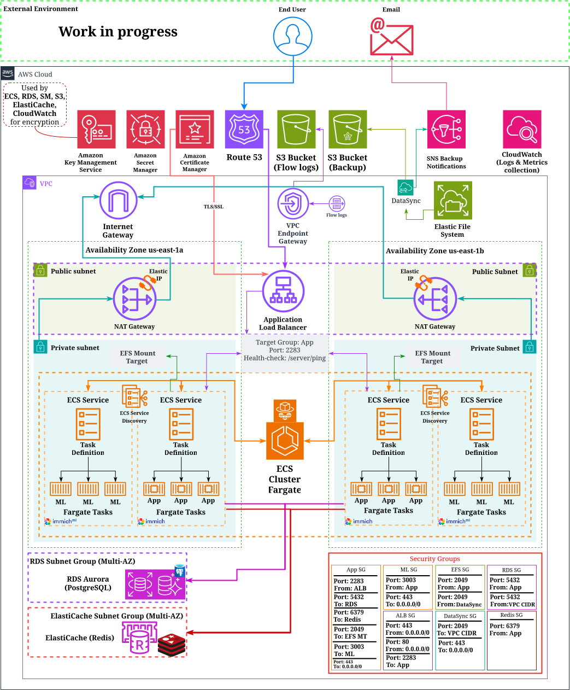

## About This Project

This repository documents my personal journey in learning and applying DevOps & CloudOps practices, methodologies, and toolkit through a practical, evolving project.

The ultimate goal is to demonstrate the integration of CI/CD processes, Infrastructure as Code (IaC), cloud infrastructure, and monitoring, metric collection and analysis — all added progressively as I advance in my skills.

> ⚠️ This is not a reference implementation. It may contain mistakes or suboptimal decisions, which I intend to revisit and improve over time.

To support this learning process, I’ve chosen [Immich](https://github.com/immich-app/immich) — a high-performance, self-hosted solution for managing personal photo and video libraries.

Many thanks to the Immich team for their work on this great application.

## 🛠️ Current State

At this stage, the infrastructure has been successfully deployed in AWS Cloud, and the application is working smoothly.
Refactoring and bug fixes are underway.

More details can be found in the [DEVLOG](devlog.md).

## 📌 Near-term plans

This section outlines the key objectives I plan to tackle next:

- **Implement full CI/CD workflow with Jenkins**
- **Integrate automated API & UI tests into CI**
- **Enchance monitoring and metrics alasysis**
- **Webhooks and advanced alerting**

These tasks represent the immediate next steps in the ongoing development of this project.
